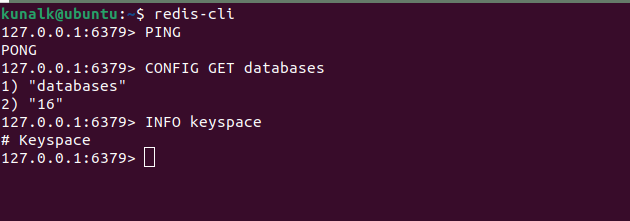
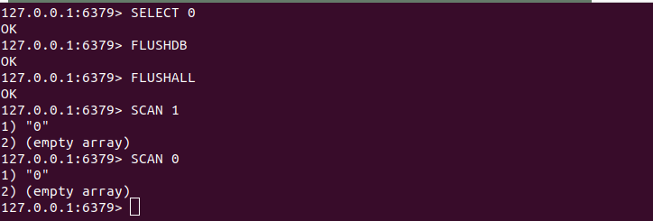
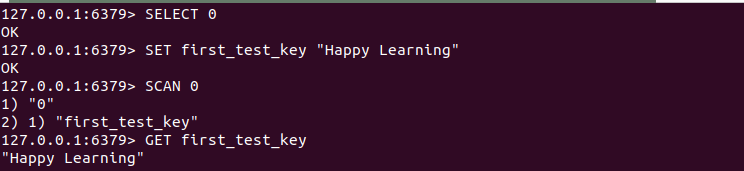
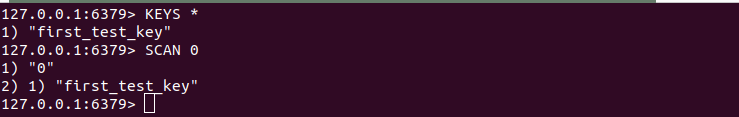

# ProjectName: A URL Shortener Application

<span id="top"></span>

 ## Design and Implement URL shortner application. ##

<p>

This application provides a simple solution for shortening URLs.Developed using Golang, it exposes REST services to perform operations related to URL shortner application.The application is integrated with `Redis` as the database to store mappings between shortened URLs and their original long URLs.

This application is a learning tool to understand `golang` programming concepts.

The REST services can be test through [cURL calls](#how-to-test-rest-services-for-url-shortner-application) or, any API Test tool.<br/>

Also, a sample front-end applicatin is also written in React to get the feel for complete development for URL shortner application

</p>

## Prerequisite ##

1. [Go](https://go.dev/doc/install)
2. [Redis](https://redis.io/docs/install/install-redis/)
3. Your Favorite IDE. I have used [Visual Studio Code Editor](https://code.visualstudio.com/download)

## How to Run the sample `Go` Project ##

* Clone the project.
* Redis is installed and the service is up and running.
* Run command from terminal `go build .` to build the project. 
* Run command from terminal `go run .` to run the application or use your IDE to start `main.go` in `debug or non-debug` mode. 
* Open Browser, Run url `http://localhost:9999/test` to test the server is up and running.
* Change/modify the desired port number if you wish. Refer function `GetHttpServerConfig()` at [Server Configuration](server/serverConfig.go).
* Use command `Ctrl+C` or `Stop` from IDE to shutdown server.

## How To Test Your Redis Database ##

| Endpoint Url                    | HTTP Method  |  HTTP Response                                   |
|---------------------------------|:------------:|-------------------------------------------------:|
| localhost:9999/key/get-key      |  GET         | Get unique key for long url from redis database  |
| localhost:9999/key/get-all-keys |  GET         | Get all keys (multiple) from redis database      |
| localhost:9999/key/add-key      |  POST        | Add or store a redis key into the database       |

Sample cURL calls:

1. Add Key into Redis

```text
curl --location 'http://127.0.0.1:9999/key/add-key' \
--header 'Content-Type: application/json' \
--data '{
    "KeyName" : "this is just a test key"
}'
```

2. Get Key From Redis

```text
curl --location --request GET 'localhost:9999/key/get-key' \
--header 'Content-Type: application/json' \
--data '{
    "KeyName" : "MyTestKey"
}'
```

3. Gell All Keys From Redis

```text
curl --location 'localhost:9999/key/get-all-keys'
```

## How To Test REST services for Url Shortner Application ##

| Endpoint Url                          |   HTTP Method  |  HTTP Response    |
|---------------------------------------|:--------------:|------------------:|
| localhost:9999/test                   |  GET           | Server Uptime     |
| localhost:9999/urls/get-short-url     |  GET           | Get short url     |
| localhost:9999/urls/create-short-url  |  POST          | Create short url  |
| localhost:9999/urls/update-short-url  |  POST          | Update short url  |
| localhost:9999/urls/delete-short-url  |  GET           | Delete short url  |

Sample cuRL calls:

1. Create Short Url

```text
curl --location 'localhost:9999/urls/create-short-url' \
--header 'Content-Type: application/json' \
--data '{
    "longUrl" : "https://go.dev/doc/tutorial/getting-started#code"
}'
```
2. Get Short Url

```text
curl --location --request GET 'http://localhost:9999/urls/get-short-url?longUrl=https%3A%2F%2Fgo.dev%2Fdoc%2Ftutorial%2Fgetting-started%23code' \
--header 'Content-Type: application/json'
```

3. Update Short Url

```text
curl --location 'http://localhost:9999/urls/update-short-url' \
--header 'Content-Type: application/json' \
--data '{
    "longUrl" : "https://go.dev/doc/tutorial/getting-started#code"
}'
```

4. Delete Short Url

```text
curl --location --request GET 'http://localhost:9999/urls/delete-short-url?longUrl=https%3A%2F%2Fgo.dev%2Fdoc%2Ftutorial%2Fgetting-started%23code' \
--header 'Content-Type: application/json'
```

## Basic Go Commands ##
1. Command to check `Go` is installed on your machine.

```text
go version
```
2. Initialize/Create a `Go` project or module.Enable dependency tracking for your project.

```text
go mod init <my-project-name>
```
<strong>Note:</strong> Command will create `go.mod` file in project directory. The `go.mod` file provides information of:
- `name` of your project
- current `Go` version in use
- details of `libraries (project's dependencies)`

<u>Example to create module/project from Command line client:</u>

```text
mkdir go-for-url-shortner
cd go-for-url-shortner
go mod init github.com/KumarVariable/go-for-url-shortner
touch main.go
```

3. How to build a `Go` application ?

```text
go build main.go
```
- Command will compile packages and dependencies in a specific file (ex: main.go)
- Command generates an executable file in the current directory, (on Unix, it's typically named after the directory; on Windows, it will have an .exe suffix).

```text
go build .
```
- Here `.` (dot) represents a current directory.
- Command to compile the package that is in the current directory, along with any dependent files in that package.
- Command generates an executable file if the package is named as `main`, otherwise it compiles the package and produces a package archive.

4. How to run a `Go` application ?

```text
go run main.go
```
- Command to tell `Go` compiler to run and run `main.go` (a specific file). This command is helpful to quickly test a single file.

```text
go run .
```
- Here `.` (dot) represents a current directory.
- Command tells `Go` to compile and run the entire package in the current directory, not just a single file.
- Command also compiles multiple `.go` files which are part of package.

5. How to run executable created through command at point #3 ?

- Locate the executable and run `./go-for-url-shortner` from the terminal

```text
./go-for-url-shortner
```

6. How to tidy/clean up unnecessary dependencies from your `Go` project ?

```text
go mod tidy
```
## Basic Redis CLI Commands ##

To start redis-client or Redis command line interface. Redis client is available in Redis package that will be installed when we install `Redis` on our machine.

```text
redis-cli
```

- Use `CONFIG GET databases` command to know the number of databases.
- Use `INFO keyspace` command to list the databases that contains keys.



- Use `SELECT <index>` command to select the database based on zero-index. Default is 0.
- Use `FLUSHDB` command to clear currently active database.
- Use `FLUSHALL` command to clear all the existing database.
- Use `SCAN <cursor>` command to iterate the set of keys into selected Redis database.



- Use `SET <key-name> <key-value>` command to create a key with value in redis database.
- Use `GET <key-name>` command to get the stored value for corresponding key in redis database.



- Use `KEYS *` command to list all keys stored in redis database.
- Use `SCAN <cursor>` command as an alternative for `KEYS` command.Better option.




**Happy Learning !**

[⬆ Back to Top](#top)